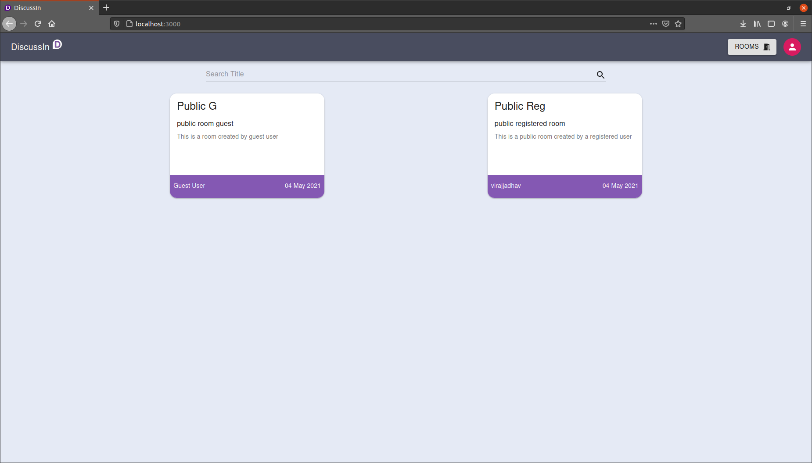

  <h1 align="center">
    DiscussIn
  </h1>
  
  

    
    <h3 align="center">
      &bull; One stop for quick discussions &bull; 
    </h3>
  

  
  

  

  

  

  &nbsp;&nbsp;&nbsp;<a href="#-about">About</a>&nbsp;&nbsp;&nbsp;&bull;&nbsp;&nbsp;&nbsp;
  <a href="#-features">Features</a>&nbsp;&nbsp;&nbsp;&bull;&nbsp;&nbsp;&nbsp;
  <a href="#built-with">Built with</a>&nbsp;&nbsp;&nbsp;&nbsp;&nbsp;&nbsp;

  

## 👨🏻‍💻 About

DiscussIn helps people to initiate, participate and contribute their views on any topic of their choice, that too in real time. It is not necessary for anyone to compulsorily register on the platform in order to start any discussion. People can easily create rooms (public or private, depending on whether they are registered or not) and invite their friends, colleagues, etc. by sharing room link to help contribute to the ongoing discussion. DiscussIn also provides a collaborative notepad, where people can document their notes, minutes of meetings, etc. in detailed format. It is easy to use, user-friendy and a one stop destination for all your quick discussions.

## 🌟 Features

-   Real time Discussions 💬
-   Collaborative Rich Text Editor 📝
-   Emoji Support 😃
-   Auto room deletion for public rooms (after certain amount of room inactivity) ✨
-   Public and Private rooms 🚪
-   Share room invites and Join other rooms 👥
-   No registration required and easy to use 💥

## 🛠️ Built with

-   <a href="https://reactjs.org/" target="_blank">ReactJS</a>
-   <a href="https://expressjs.com/" target="_blank">Express<a>
-   <a href="https://nodejs.org/en/" target="_blank">NodeJS</a>
-   <a href="https://socket.io/" target="_blank">Socket.io</a>
-   <a href="https://www.mongodb.com/" target="_blank">MongoDB</a>
-   <a href="https://material-ui.com/" target="_blank">Material UI</a>
